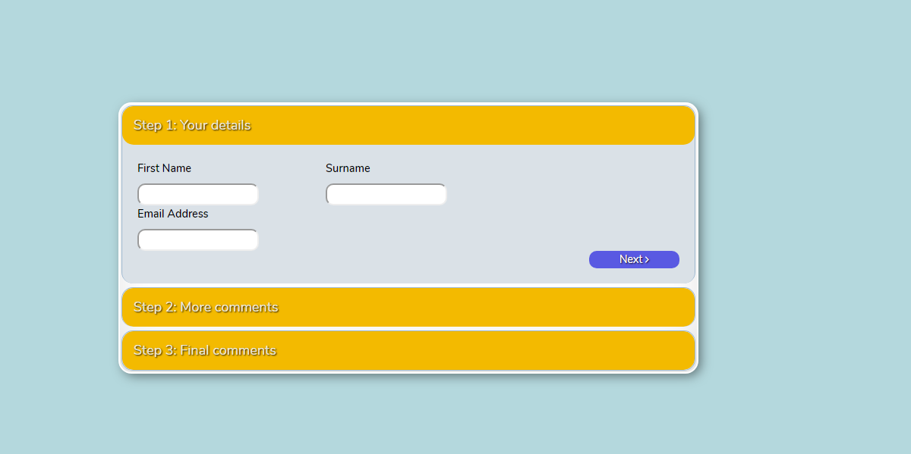
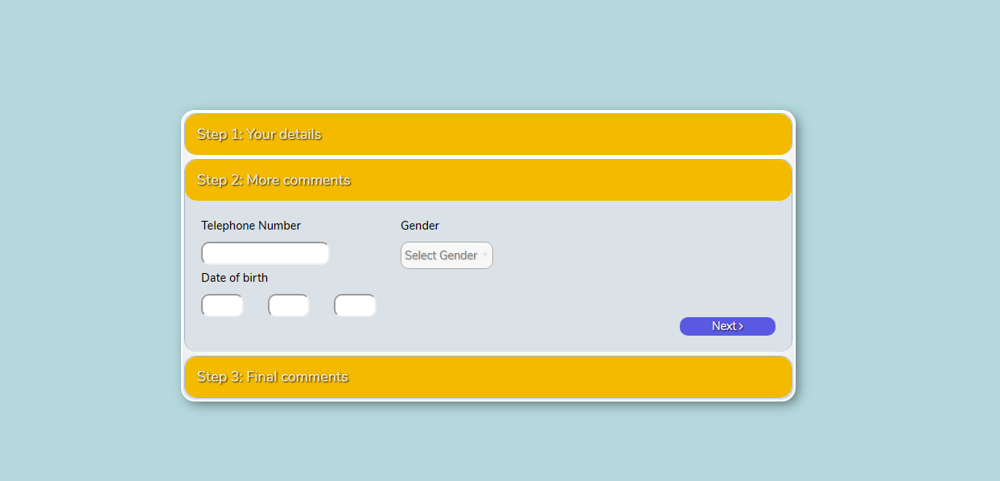
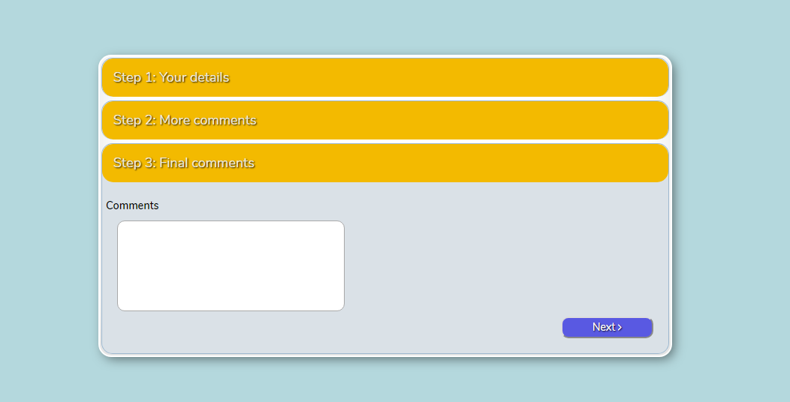
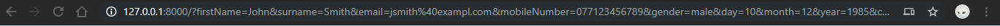
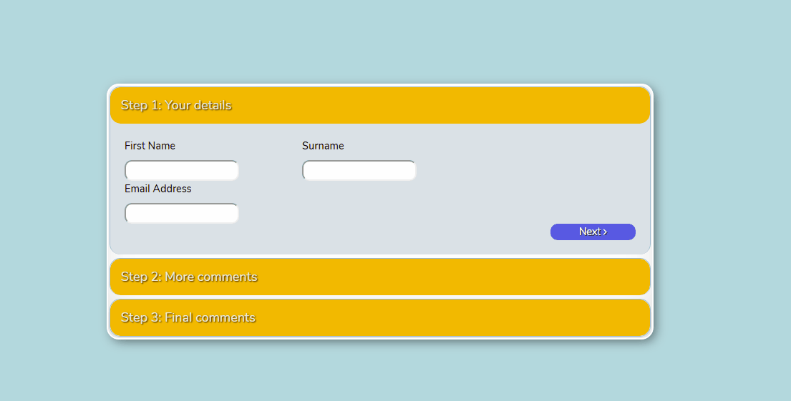
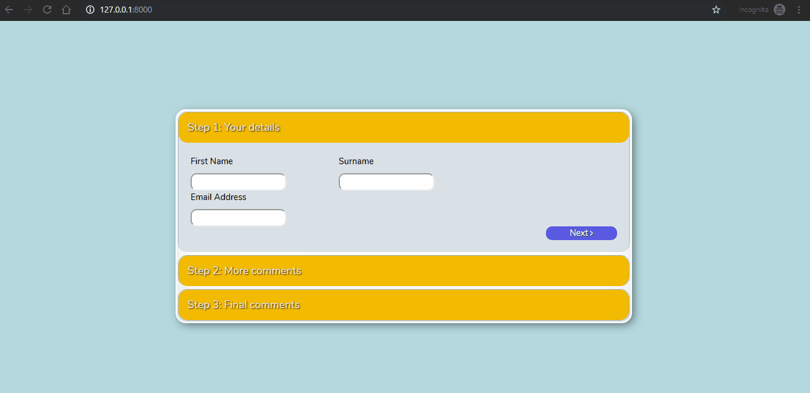
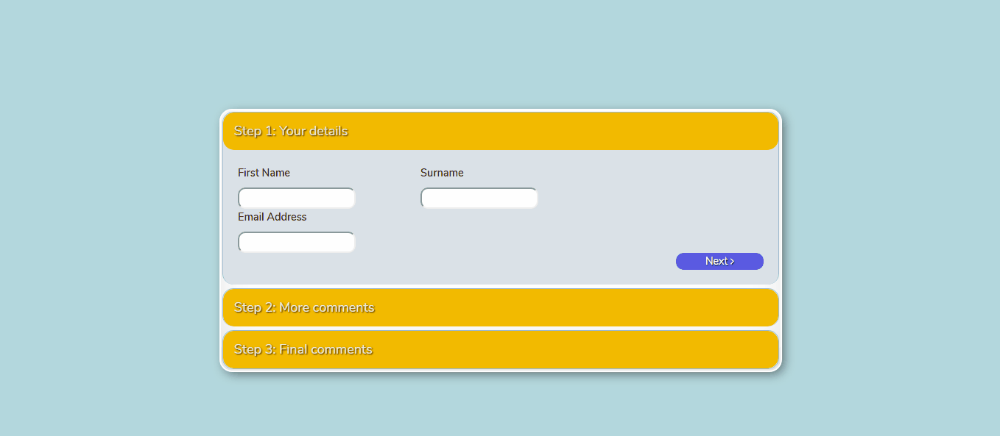

## Requirements

In order to run this project, first you need to make sure that you have the following requirements installed on your computer:

- php (version 7.2.19 was used)
- MySQL (version 5.7.24 was used)
- node.js (v10.16.3 (LTS) was used)
- composer (version 1.9.0 was used)

## How to install

First, clone this repository.

Second, open the project directory and run the following command in a terminal (git bash was used on Windows):

```
cp .env.example .env
```
this will make a copy of the .env file where you will need to add information for the database and the project.

Third, run the following commands to install node and laravel dependencies:

> For node

```
npm install
```
> For laravel

```
composer install
```

Next, run this additional command to generate an encryption key that is required for your .env file.

```
php artisan key:generate
```

At this point, if no errors have been occured upon running the above commands, all the dependencies should be installed.

The last step is to create a database and add some initial data for testing the API.

First create a database with a name of your choosing and open the .env file to include the name of the DB, the username and the password (if any) in the fields:

- DB_DATABASE= (any name)
- DB_USERNAME= (username, default is root)
- DB_PASSWORD= (leave empty if not given any)

Next, start the database (e.g. within XAMPP, Laragon if on Windows) and run the following command to make the database migrations and install the tables for the project on the database:

```
php artisan migrate
```
If no errors have been occured you should see something similar to the following on your terminal:

```
Migration table created successfully.
Migrating: 2014_10_12_000000_create_users_table
Migrated:  2014_10_12_000000_create_users_table (0.08 seconds)
Migrating: 2014_10_12_100000_create_password_resets_table
Migrated:  2014_10_12_100000_create_password_resets_table (0.13 seconds)
Migrating: 2019_08_19_000000_create_failed_jobs_table
Migrated:  2019_08_19_000000_create_failed_jobs_table (0.08 seconds)
Migrating: 2019_10_09_194933_create_forms_table
Migrated:  2019_10_09_194933_create_forms_table (0.08 seconds)
```

Next, within a database management program (like phpmyadmin for example), find the database you have created and add some initial data in the **Forms** table.

Lastly, open two separated terminal windows in the project folder and run the following commands:

> Window 1 - Running node for live rendering of changes.

```
npm run watch
```

> Window 2 - Running laravel internal server.

```
php artisan serve
```

The second command will provide you with a localhost address where you can see the project live on your browser.

## What works and what was built so far

Regarding the design, it can be seen from the figures 1-3 that, a very close approximation was created based on the original mock-up.

<figure>
  
  <figcaption>Figure 1 - Step 1: Your Details section.</figcaption>
</figure>

 <br/>

 <figure>
     
    <figcaption>Figure 2 - Step 2: More Comments section.</figcaption>
</figure>

<br/>

 <figure>
    
    <figcaption>Figure 3 - Step 3: Final Comments section.</figcaption>
</figure>

 <br/>

Additionally, from figure 4 it can be seen that the last *Next* button attempts a form submission as the data will appear on the address bar after the button is clicked.
 
 <figure>
     
    <figcaption>Figure 4 - Data are being submitted through the from.</figcaption>
</figure>

</br>

 From figure 5, it  can be seen that the sections animate as requested in the requirements. Navigation can be done by either clicking on the section titles or the *Next* buttons except for the last one which, as mentioned before, submits the form.

<figure>
      
    <figcaption>Figure 5 - Form's design animations.</figcaption>
</figure>

<br/>

From figure 6, it can be seen that, if you navigate on the path `/api/form` you can access directly the data that you have inserted upon the installation process in a Json form. Addtionally, if you add the on the path an id number e.g. `api/form/1` you can access a single entry if it exists.

<figure>
    
    <figcaption>Figure 6 - Accessing data from Laravel API route.</figcaption>
</figure>

 <br/>

 From figure 7, it can be seen that the existing data are being retrieved with the use of Axios Http client on React. You can test it by yourself by clicking inspect on your browser and look on your console for the *Forms* array under the *State* object.

 <figure>
     
    <figcaption>Figure 7 - Accessing data state through Axios Http client.</figcaption>
</figure>


